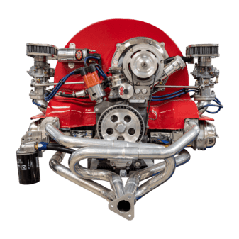

  
  <h1 style="font-size: 28px; margin: 10px 0;">Crystal Crash</h1>
  
Jogo de quebra-cabeça baseado em fisica

Sumário (clique para exibir)

  
- [Descrição](#descrição)
- [Licença](#licença)

## Descrição

Jogo baseado em fisica inspirado em Angry Birds.

## Licença

[AGPL v3.0](https://choosealicense.com/licenses/agpl-3.0/)
